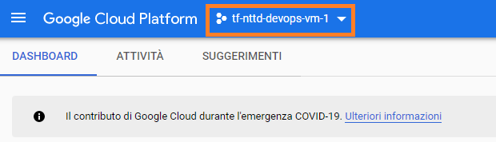
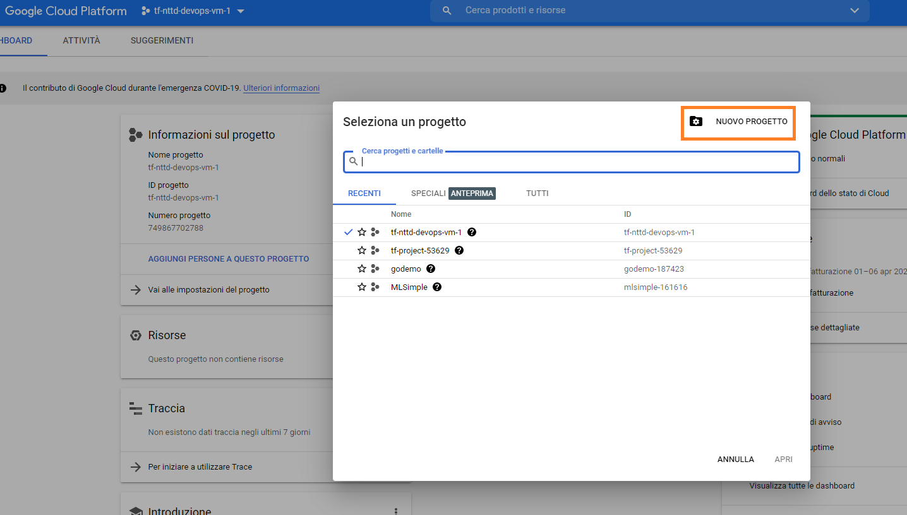
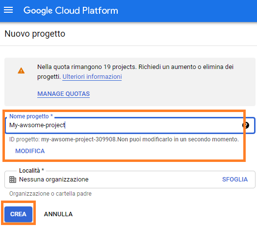
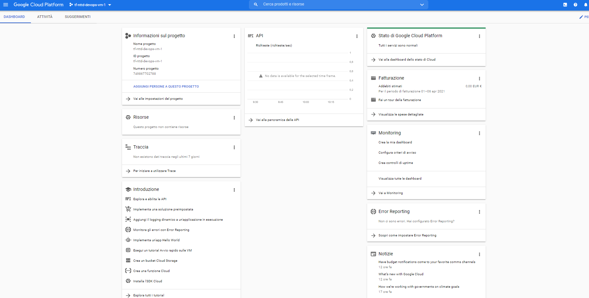
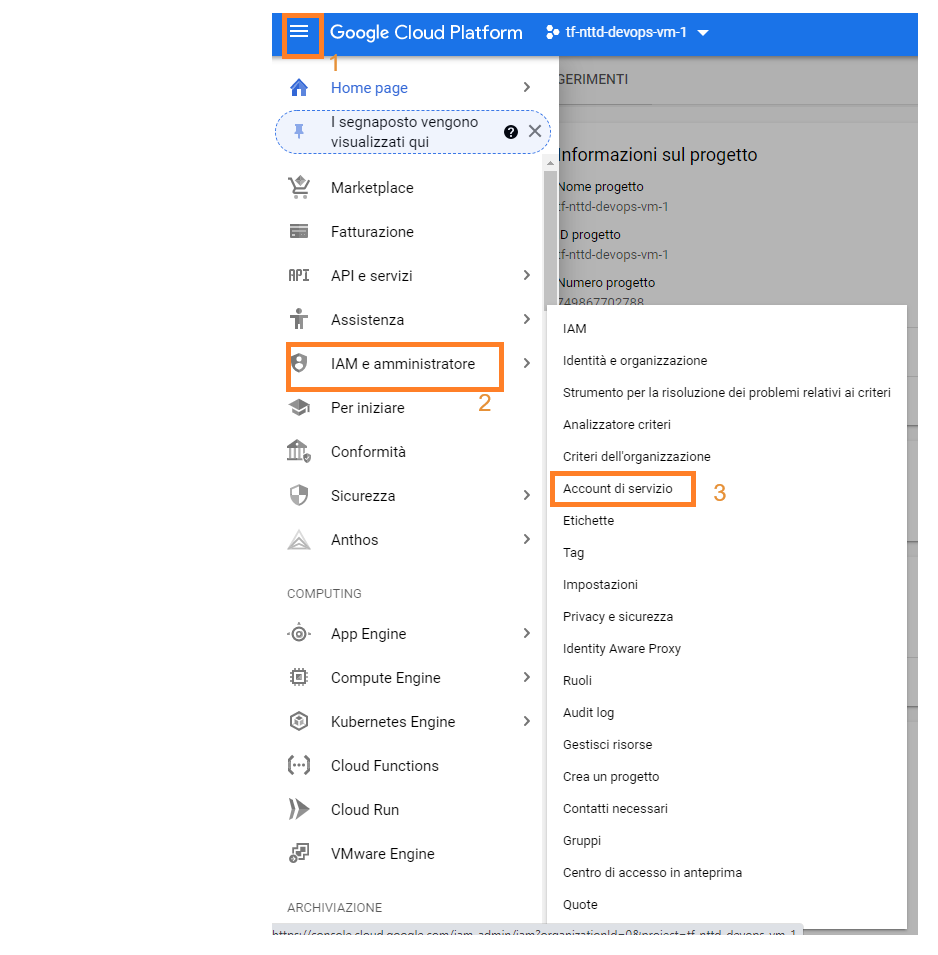
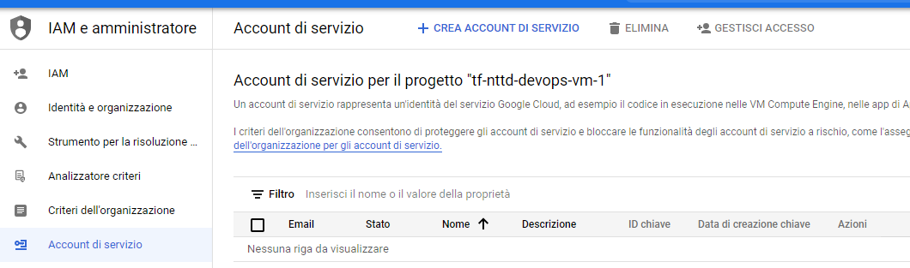

# Setting up GCP

Create project on gcp: (open up a free account if needed)

Click drop-down

Click 'New Project'

Project is created, Dashboard is presented.

1 Click upper left corner  --> 2 IAM and Admin --> 3 Service Account (Account di Servizio)

Select the project you created in the previous step.

- Under **Service account**, select **New service account**.
- Give it any name you like.
- For the **Role**, choose **Project -> Editor**.
- Leave the **Key Type** as JSON.
- Click **Create** to create the key and save the key file to your system.

Download the generated JSON file and save it to the directory of your project.

Enable the following APIs on the project where your VPC resides:
Go to:

- Compute Engine API → [*https://console.cloud.google.com/apis/library/compute.googleapis.com*](https://console.cloud.google.com/apis/library/compute.googleapis.com)
- Cloud Resource Manager API → [*https://console.cloud.google.com/apis/library/cloudresourcemanager.googleapis.com*](https://console.cloud.google.com/apis/library/cloudresourcemanager.googleapis.com)

And click 'Enable' button.
GCP part of the Lab ends here.