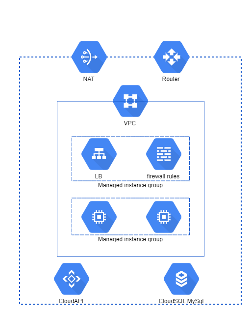

# A more real scenario

This is an introduction to the process of writing **Terraform** scripts to automate building and provisioning of cloud infrastructures

## Project Organization

We will use various files for the resources, roughly divided "by tier" splitting which enforce "separation of concerns" architectural pattern.

The infrastructure that we will be building then provisioning is depicted in figure.

Here, you will deploy two..n Ubuntu virtual machines running the **Apache** web server located in a private subnet without a public IP address, and we will use a load balancer to publish the web service on the port 80.

**Managed instance groups** let you operate apps on multiple identical VMs. You can make your workloads scalable and highly available by taking advantage of autoscaling, autohealing, regional (multiple zones) deployment, and automatic updating. This option requires a **virtual machine template**.

The project layout to do this is like this:

### Terraform Provider: 
- **main.tf**

### Network
- **network.tf**
- **network-firewall.tf**

### Virtual Machines (Managed Instance Group)

- **vm.tf**

### Load Balancer

- **lb-managed.tf**

## Variables

Another best practice that Terraform enforces is putting all the configuration variable placeholders in seperate file(s) so that the infrastructure files have to be touched only in case you have to add/modify "real" pieces of the layout or more placeholders.
And a file where are stored the values that differ from default.
Here in this case we have a couple of *"placeholder"* files:

- **variables.tf**
- **lb-managed.variables.tf**

And one with the customized variables

- **terraform.tfvars**

Beside these, there are other files for the _*terraform output variables*_

- **vm-output.tf**

These file are useful to display relevant data variables after the infrastructure is provisioned.

## Advanced best practices

- ### https://www.terraform.io/docs/cloud/guides/recommended-practices/index.html