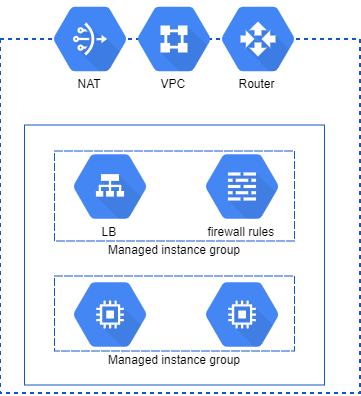

# A more real scenario

This is an introduction to the process of writing **Terraform** scripts to automate building and provisioning of cloud infrastructures

## Project Organization

We will use various files for the resources, roughly divided "by tier" splitting which enforce "separation of concerns" architectural pattern.

The infrastructure that we will be building then provisioning is depicted in figure.




Here, you will deploy two..n Ubuntu virtual machines running the **Apache** web server located in a private subnet without a public IP address, on the port 80. All by using GCP Cloud Provider and Services.

**Managed instance groups** let you operate apps on multiple identical VMs. You can make your workloads scalable and highly available by taking advantage of autoscaling, autohealing, regional (multiple zones) deployment, and automatic updating. This option requires a **virtual machine template**.

The project layout to do this is like this:

### Terraform Provider: 
- **main.tf**

```
# setup the GCP provider | provider.tf

terraform {
  required_version = ">= 0.12"
}
provider "google" {
  project    = var.app_project
  credentials = file(var.gcp_auth_file)
  region      = var.gcp_region_1
  zone        = var.gcp_zone_1
}
provider "google-beta" {
  project    = var.app_project
  credentials = file(var.gcp_auth_file)
  region      = var.gcp_region_1
  zone        = var.gcp_zone_1
}
```


### Network
- **network.tf**

```
# create private subnet

resource "google_compute_subnetwork" "private_subnet_1" {
  provider = "google-beta"
  purpose = "PRIVATE"
  name = "${var.app_name}-private-subnet-1"
  ip_cidr_range = var.public_subnet_cidr_1
  network = google_compute_network.vpc.name
  region = var.gcp_region_1
}

resource "google_compute_address" "nat-ip" {
  name = "${var.app_name}-nat-ip"
  project = var.app_project
  region = var.gcp_region_1
}

# create a nat to allow private instances connect to internet

resource "google_compute_router" "nat-router" {
  name = "${var.app_name}-nat-router"
  network = google_compute_network.vpc.name
}

resource "google_compute_router_nat" "nat-gateway" {
  name = "${var.app_name}-nat-gateway"
  router = google_compute_router.nat-router.name
  nat_ip_allocate_option = "MANUAL_ONLY"
  nat_ips = [ google_compute_address.nat-ip.self_link ]
  source_subnetwork_ip_ranges_to_nat = "ALL_SUBNETWORKS_ALL_IP_RANGES"
  depends_on = [ google_compute_address.nat-ip ]
}

output "nat_ip_address" {
  value = google_compute_address.nat-ip.address
}
```


- **network-firewall.tf**

```
# allow http traffic
resource "google_compute_firewall" "allow-http" {
  name = "${var.app_name}-fw-allow-http"
  network = google_compute_network.vpc.name
  allow {
    protocol = "tcp"
    ports    = ["80"]
  }
  target_tags = ["http"]
}
# allow https traffic
resource "google_compute_firewall" "allow-https" {
  name = "${var.app_name}-fw-allow-https"
  network = google_compute_network.vpc.name
  allow {
    protocol = "tcp"
    ports    = ["443"]
  }
  target_tags = ["https"]
}
# allow ssh traffic
resource "google_compute_firewall" "allow-ssh" {
  name = "${var.app_name}-fw-allow-ssh"
  network = google_compute_network.vpc.name
  allow {
    protocol = "tcp"
    ports    = ["22"]
  }
  target_tags = ["ssh"]
}
# allow rdp traffic
resource "google_compute_firewall" "allow-rdp" {
  name = "${var.app_name}-fw-allow-rdp"
  network = google_compute_network.vpc.name
  allow {
    protocol = "tcp"
    ports    = ["3389"]
  }
  target_tags = ["rdp"]
}


```


### Virtual Machines (Managed Instance Group)

- **vm.tf**

Create a **vm.tf** file with settings related to the spinning up of a vm instances with autoscaling 


```
# Create VM to autoscale

resource "google_compute_instance_template" "web_server" {
  name = "${var.app_name}-web-server-template"
  description = "This template is used to create Apache web server"
  instance_description = "Web Server running Apache"
  can_ip_forward = false
  machine_type = "g1-small"
  tags = [
    "ssh",
    "http"]
  scheduling {
    automatic_restart = true
    on_host_maintenance = "MIGRATE"
  }
  network_interface {
    network = google_compute_network.vpc.name
    subnetwork = google_compute_subnetwork.private_subnet_1.name
  }
  lifecycle {
    create_before_destroy = true
  }

  metadata_startup_script = "sudo apt-get update; sudo apt-get install -yq build-essential apache2"

  disk {
    source_image = "ubuntu-os-cloud/ubuntu-1804-lts"
    auto_delete = true
    boot = true
  }
}

```

The **tags** are used to attach firewall rules defined in the **network-firewall.tf** files. In this case, we are allowing **SSH** to manage the server and **HTTP** to allow Apache to serve web pages.


### Load Balancer

- **lb-managed**

Resources needed:

- **google_compute_global_forwarding_rule** → used to forward traffic to the correct load balancer for HTTP load balancing.
- **google_compute_target_http_proxy** → used by one or more global forwarding rule to route incoming HTTP requests to a URL map
- **google_compute_backend_service** → defines a group of virtual machines that will serve traffic for load balancing
- **google_compute_instance_group** → creates a group of dissimilar virtual machine instances
- **google_compute_health_check** → determine whether instances are responsive and able to do work
- **google_compute_url_map** → used to route requests to a backend service based on rules that you define for the host and path of an incoming URL

Create an **lb-managed.tf** file and add the following code:

```
# Load balancer with managed instance group | lb-managed.tf

# used to forward traffic to the correct load balancer for HTTP load balancing

resource "google_compute_global_forwarding_rule" "global_forwarding_rule" {
  name = "${var.app_name}-global-forwarding-rule"
  project = var.app_project
  target = google_compute_target_http_proxy.target_http_proxy.self_link
  port_range = "80"
}

# used by one or more global forwarding rule to route incoming HTTP

resource "google_compute_target_http_proxy" "target_http_proxy" {
  name = "${var.app_name}-proxy"
  project = var.app_project
  url_map = google_compute_url_map.url_map.self_link
}

# defines a group of virtual machines that will serve traffic for load balancing

resource "google_compute_backend_service" "backend_service" {
  name = "${var.app_name}-backend-service"
  project = var.app_project
  port_name = "http"
  protocol = "HTTP"
  # **differs from unmanaged**
  load_balancing_scheme = "EXTERNAL"
  health_checks = [google_compute_health_check.healthcheck.self_link]
  backend {

    group = google_compute_instance_group_manager.web_private_group.instance_group

    balancing_mode = "RATE"
    max_rate_per_instance = 100
  }
}

# creates a group of dissimilar virtual machine instances

resource "google_compute_instance_group_manager" "web_private_group" {
  name = "${var.app_name}-vm-group"
  description = "Web servers instance group"
  base_instance_name = "${var.app_name}-web"
  zone = var.gcp_zone_1
  version {
    instance_template  = google_compute_instance_template.web_server.self_link
  }
  named_port {
    name = "http"
    port = "80"
  }
}

# determine whether instances are responsive and able to do work

resource "google_compute_health_check" "healthcheck" {
  name = "${var.app_name}-healthcheck"
  timeout_sec = 1
  check_interval_sec = 1
  http_health_check {
    port = 80
  }
}
resource "google_compute_url_map" "url_map" {
  name = "${var.app_name}-load-balancer"
  project = var.app_project
  default_service = google_compute_backend_service.backend_service.self_link
}

# automatically scale virtual machine instances in managed instance groups according to an autoscaling policy

resource "google_compute_autoscaler" "autoscaler" {
  name = "${var.app_name}-autoscaler"
  project = var.app_project
  zone = var.gcp_zone_1
  target  = google_compute_instance_group_manager.web_private_group.self_link
  autoscaling_policy {
    max_replicas = var.lb_max_replicas
    min_replicas = var.lb_min_replicas
    cooldown_period = var.lb_cooldown_period
    cpu_utilization {
      target = 0.8
    }
  }
}

# show external ip address of load balancer

output "load-balancer-ip-address" {

  value = google_compute_global_forwarding_rule.global_forwarding_rule.ip_address

}
```


## Variables

Another best practice that Terraform enforces is putting all the configuration variable placeholders in seperate file(s) so that the infrastructure files have to be touched only in case you have to add/modify "real" pieces of the layout or more placeholders.
And a file where are stored the values that differ from default.
Here in this case we have a couple of *"placeholder"* files:

- **variables.tf**

```
# GCP authentication file
variable "gcp_auth_file" {
  type = string
  description = "GCP authentication file"
}

# define GCP project name
variable "app_project" {
  type = string
  description = "GCP project name"
}

# define application name
variable "app_name" {
  type = string
  description = "Application name"
}

# define application domain
variable "app_domain" {
  type = string
  description = "Application domain"
}

# define application environment
variable "app_environment" {
  type = string
  description = "Application environment"
}

# define GCP region
variable "gcp_region_1" {
  type = string
  description = "GCP region"
}
# define GCP zone
variable "gcp_zone_1" {
  type = string
  description = "GCP zone"
}
# define Public subnet
variable "public_subnet_cidr_1" {
  type = string
  description = "Public subnet CIDR 1"
}

```


- **lb-managed.variables.tf**

```
# maximum number of VMs for load balancer autoscale

variable "lb_max_replicas" {
  type = string
  description = "Maximum number of VMs for autoscale"
  default = "4"
}

# minimum number of VMs for load balancer autoscale

variable "lb_min_replicas" {
  type = string
  description = "Minimum number of VMs for autoscale"
  default = "1"
}

# number of seconds that the autoscaler should wait before it starts collecting information

variable "lb_cooldown_period" {
  type = string

  description = "The number of seconds that the autoscaler should wait before it starts collecting information from a new instance"

  default = "60"
}

```

And one with the customized variables (tipically GCP credentials and stuff)

- **terraform.tfvars**

```
# GCP Settings
app_project = "tf-nttd-devops-vm-1"
app_name = "tf-demo-lab"
app_domain = "nttdata.com"
app_environment = "dev"
gcp_region_1  = "europe-west1"
gcp_zone_1    = "europe-west1-b"
gcp_auth_file = "tf-nttd-devops-vm-1.json"
 # GCP Network
public_subnet_cidr_1  = "10.10.1.0/24"

```

Beside these, there are other files for the _*terraform output variables*_

- **vm-output.tf**

```
# Virtual machine output | vm-output.tf

output "webserver-name" {
  value = google_compute_instance_template.web_server.name
}
output "webserver-internal-ip" {

  value = google_compute_instance_template.web_server.network_interface[0].network_ip

}
```

These file are useful to display relevant data variables after the infrastructure is provisioned.


## Advanced best practices

- ### https://www.terraform.io/docs/cloud/guides/recommended-practices/index.html